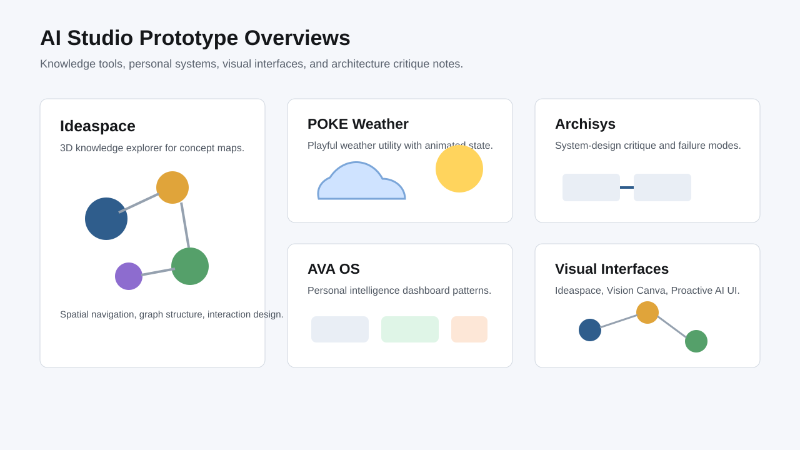

# AI Studio Prototype Overviews

Curated public notes for AI Studio prototypes exploring personal agents, visual interfaces, knowledge tools, and system-design workflows.

This repository is documentation-only. It does not contain production source code, credentials, private screenshots, customer data, raw exports, or live operational files.

## Prototype Index

| Prototype | Theme | Status | Notes |
|---|---|---|---|
| [POKE Weather](prototypes/poke-weather.md) | Playful animated weather interface | Active concept | Lightweight visual build with personality |
| [AVA OS](prototypes/ava-os.md) | Personal AI dashboard and knowledge interface | Active concept | Personal intelligence, graph, interview, and onboarding modes |
| [Ideaspace](prototypes/ideaspace.md) | 3D knowledge explorer | Active concept | Concept mapping into an interactive visual world |
| [Vision Canva](prototypes/vision-canva.md) | Text-to-entity graph canvas | Active concept | Turns unstructured text into explorable structure |
| [Archisys](prototypes/archisys.md) | System-design critique sandbox | Active concept | Architecture critique and failure-mode review |
| [Proactive AI Interface](prototypes/proactive-ai-interface.md) | Feedback-driven suggestion interface | Active concept | Tests proactive AI and learning loops |
| [Clawdbot Neural Engine UI](prototypes/clawdbot-neural-engine-ui.md) | WebGL system-monitoring interface | Visual prototype | 3D/motion interface exploration |
| [Elvis The Bulldog](prototypes/elvis-the-bulldog.md) | Character interaction demo | Playful prototype | Talking character experiment |
| [ThreatLens](prototypes/threatlens.md) | AI red-team simulation UI | Unfeatured experiment | Kept as exploratory security/failure-mode work |
| [AVA Demo](prototypes/ava-demo.md) | Terminal-style personal assistant | Earlier prototype | Earlier AVA direction |

## Shared Notes

- [Prototype matrix](docs/PROTOTYPE_MATRIX.md)
- [AI Studio key and spend boundary](docs/AI_STUDIO_KEY_BOUNDARY.md)
- [Production readiness checklist](docs/PRODUCTION_READINESS.md)
- [Visual materials boundary](docs/VISUAL_MATERIALS.md)

## Repository Boundary

Use this repository for public technical notes only.

Do not add:

- production source code
- credentials
- private screenshots
- customer data
- raw exports
- internal business records
- live operational files
